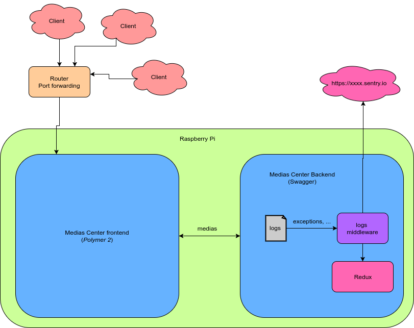

# 1. Medias center

A JS project to share medias through a web interface, with Polymer 2 for the frontend and NodeJS 8 for the backend. 
Still not impressive but will pool other famous and innovative technologies (Redux, Docker, Sentry, ...).

Stay tuned!

<!-- TOC -->

- [1. Medias center](#1-medias-center)
    - [1.1. Too long, didn't read (tl;dr)](#11-too-long-didnt-read-tldr)
    - [1.2. Functional](#12-functional)
    - [1.3. Technical](#13-technical)
        - [1.3.1. Prerequisites](#131-prerequisites)
        - [1.3.2. Development](#132-development)
            - [1.3.2.1. Standalone](#1321-standalone)
            - [1.3.2.2. Docker](#1322-docker)
        - [1.3.3. Delivery](#133-delivery)
        - [1.3.4. Configuration](#134-configuration)
        - [1.3.5. NPM scripts](#135-npm-scripts)
            - [1.3.5.1. Frontend](#1351-frontend)
            - [1.3.5.2. Backend](#1352-backend)
        - [1.3.6. Network](#136-network)
        - [1.3.7. Medias](#137-medias)
        - [1.3.8. Tests and code coverage](#138-tests-and-code-coverage)
    - [1.4. Known issues](#14-known-issues)
    - [1.5. Improvements](#15-improvements)
    - [1.6. Contributing](#16-contributing)
    - [1.7. License](#17-license)
    - [1.8. Resources](#18-resources)

<!-- /TOC -->

## 1.1. Too long, didn't read (tl;dr)

__Frontend__

```shell
cd frontend && npm run start
```

__Backend__

```shell
cd backend && npm run start
```

## 1.2. Functional

To set the context, this project has been delivered on a private Raspberry Pi. The following content will try to explain how does it work.

1. When requesting the application with its IP address, you'll request a router which, with port forwarding, will forward the request until the Raspberry Pi and the correct port.
1. You'll find the frontend loading the resources (the medias) by sending a GET request to the backend.
1. The backend will read the folder containing medias to get all the necessary information and fetch it to the frontend.
1. If an error is raised up, the backend will send it to a Sentry.io dashboard to be able to sum up efficiently received error logs.
1. To be able to reproduce errors situation and fix it, data will be fetched to a Redux store too.

Here a schema for a better comprehension of the workflow.



## 1.3. Technical

### 1.3.1. Prerequisites

You'll need

- git: To clone the project
- nodejs/npm: To run scripts
- docker-compose (docker-compose.yml v3 --> Docker Engine Release > 1.13.0 +): To run app through containers (in a future version)

### 1.3.2. Development

#### 1.3.2.1. Standalone

If you want to run the app in a _dev_ mode __without__ Docker, clone the project

```shell
git clone [-b branch-name] git@github.com:gigouni/polymer2-medias-center.git
```

and run the app in two phases

```shell
# Run the frontend (in a first terminal window)
cd frontend && npm run start

# Run backend (in another terminal window)
cd backend && npm run start
```

Just edit the source code and re-run ̀```npm run start``` if necessary.

#### 1.3.2.2. Docker

If you want to run the app in a _dev_ mode __with__ Docker, clone the project

```shell
git clone [-b branch-name] git@github.com:gigouni/polymer2-medias-center.git
```

and run the app (__not implemented yet__)

```shell
docker-compose up -d
```

### 1.3.3. Delivery

__TODO__: Needs to be completed

### 1.3.4. Configuration

To configure most of the project, two files has been added.

- [frontend/config.js](frontend/config.js): For frontend configuration
- [backend/config.js](backend/config.js): For backend configuration

When in _dev_ mode, the frontend runs with a _dev_ version of the config file. When you're setting it in production, you may need to use other configuration.
You'll need to implement the [frontend/config.prod.js](frontend/config.prod.js) file and run

```shell
./switchConf.sh
```

Re-run it to pass from _prod_ mode to _dev_ mode.

### 1.3.5. NPM scripts

The frontend and backend NPM scripts are pretty much the same. Here are fast explanations of their use.

_Examples_

```shell
npm run start
npm run test
npm run coverage-test
```

#### 1.3.5.1. Frontend

- __start__: Run the server
- __install_deps__: Install dependencies
- __check__: Lint Polymer sources
- __test__: Run tests
- __clean__: Remove _node_modules_ and _bower_components_

#### 1.3.5.2. Backend

- __start__: Run the server
- __check__: Lint sources
- __edit__: Edit Swagger configuration
- __test__: Run tests
- __coverage-test__: Run tests and set a code coverage status

### 1.3.6. Network

__TODO__: Needs to be completed

(PM2, port forwarding ? --> security, )

### 1.3.7. Medias

The medias, here images and videos, are currently stored in the [frontend/medias](frontend/medias) folder. Just add yours to see them in the app. If the extension of your file isn't handled yet, you won't see it by the way.

__Handled extensions__

- Images: PNG, JPEG, JPG
- Videos: MP4, OGG (depending of your browser)

Some other ones are coming in the future.

### 1.3.8. Tests and code coverage

To run tests

```shell
npm run test
```

If you want to know the code coverage status

```shell
npm run code-coverage
```

Here the status of the current code coverage status (14th of January, 2018 - 12h45)

```shell
9 passing (465ms)

=============================== Coverage summary ===============================
Statements   : 90.54% ( 67/74 )
Branches     : 84.38% ( 27/32 )
Functions    : 100% ( 4/4 )
Lines        : 90.54% ( 67/74 )
================================================================================
```

__Pro tip__

Run a server into the ```coverage/lcov-report/``` folder to look at coverage report

```shell
cd backend
npm run coverage-test
cd coverage/lc-report
../../node_modules/.bin/http-server
```

## 1.4. Known issues

See [issues](https://github.com/gigouni/polymer2-medias-center/issues).

## 1.5. Improvements

See [CHANGELOG](./CHANGELOG.md).

## 1.6. Contributing

No __direct__ contribution needed. But you can still submit [issues here](https://github.com/gigouni/polymer2-medias-center/issues) and [pull requests here](https://github.com/gigouni/polymer2-medias-center/pulls).

## 1.7. License

See [LICENSE](./LICENSE).

## 1.8. Resources

- Videos samples: [www.divx.com/en/devices/profiles/video](www.divx.com/en/devices/profiles/video) & [http://techslides.com/sample-webm-ogg-and-mp4-video-files-for-html5](http://techslides.com/sample-webm-ogg-and-mp4-video-files-for-html5)